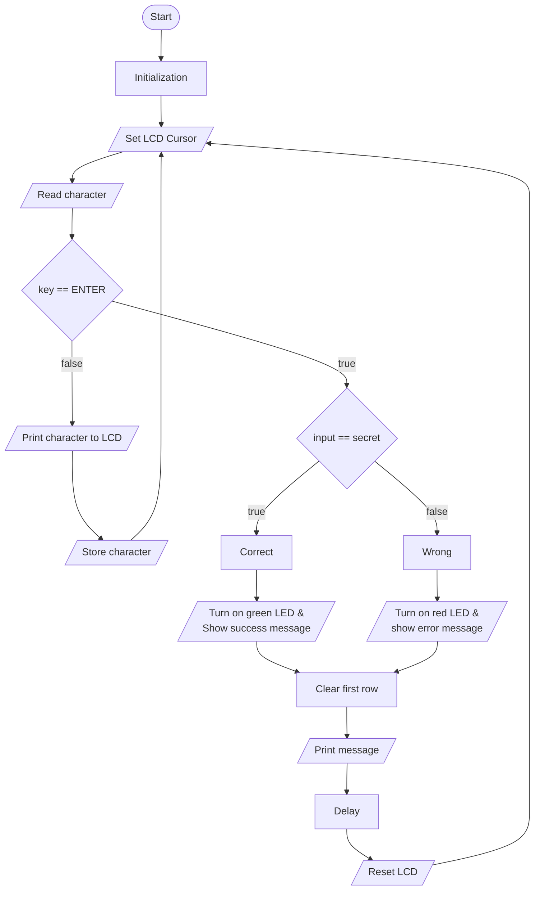

Loop diagram

```cpp
void loop()
{
    lcd.setCursor(input_size, 1);

    char key = keypad.getKey();
    if (key && key != ENTER && input_size < sizeof(input) - 1)
    {
        lcd.print(key);
        input[input_size] = key;
        input_size++;
    }
    else if (key == ENTER)
    {
        input[input_size] = '\0';
        printf("Input: %s\n", input);
        if (strcmp(input, secret) == 0)
        {
            digitalWrite(GREEN_LED_OUT, HIGH);
            // clean first row
            lcd.setCursor(0, 0);
            lcd.print("                ");
            lcd.setCursor(0, 0);
            lcd.print("Correct!");
        }
        else
        {
            digitalWrite(RED_LED_OUT, HIGH);
            // clean first row
            lcd.setCursor(0, 0);
            lcd.print("                ");
            lcd.setCursor(0, 0);
            lcd.print("Wrong!");
        }
        delay(2000);
        digitalWrite(GREEN_LED_OUT, LOW);
        digitalWrite(RED_LED_OUT, LOW);
        init_lcd();
    }
}
```


