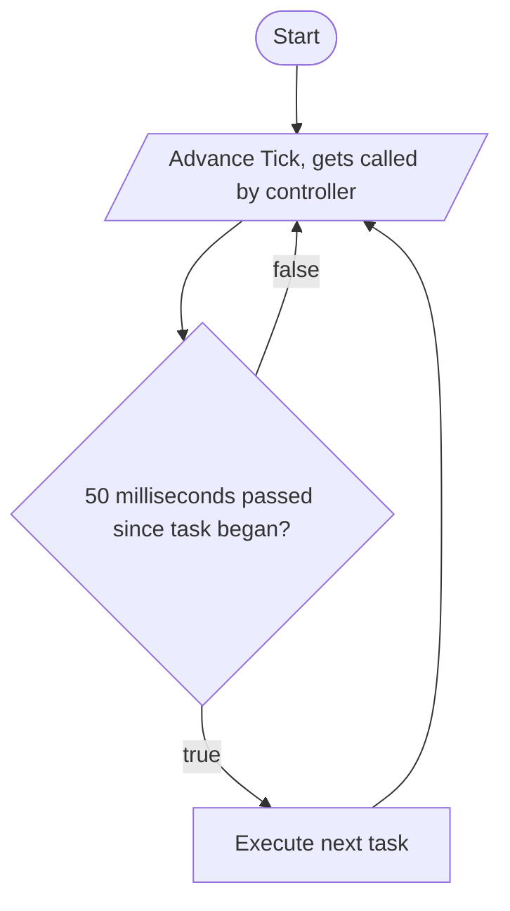
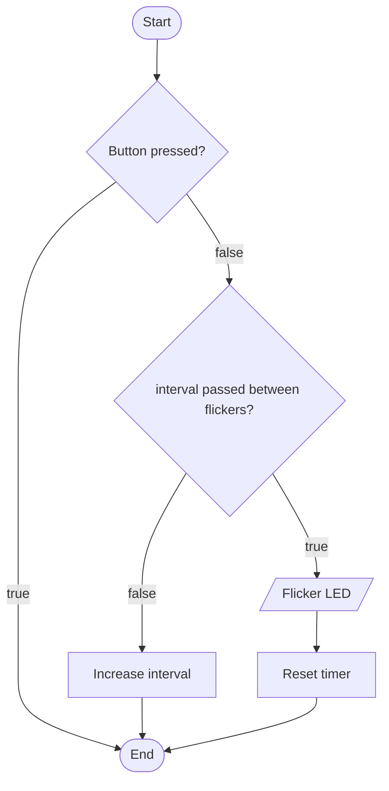

Scheduler diagram

```cpp
typedef void (*Task)(void);

class Scheduler
{
private:
    const size_t MAX_MILLIS_PER_TASK = 50;
    Task *tasks;
    size_t size = 0;
    uint16_t executionMillis = 0;
    uint16_t lastTickMillis = millis();
    size_t currentTaskIndex = 0;

public:
    Scheduler(size_t max_size)
    {
        tasks = new Task[max_size];
    }
    ~Scheduler()
    {
        delete[] tasks;
    }
    void addTask(Task task)
    {
        tasks[size++] = task;
    }
    void advanceTick()
    {
        uint16_t currentMillis = millis();
        uint16_t elapsedMillis = currentMillis - lastTickMillis;
        lastTickMillis = currentMillis;
        executionMillis += elapsedMillis;
        if (executionMillis >= MAX_MILLIS_PER_TASK)
        {
            executionMillis = 0;
            tasks[currentTaskIndex]();
            currentTaskIndex = (currentTaskIndex + 1) % size;
        }
    }
};
```



Led flicker chart

```cpp
void flicker_task()
{
    if (!ledButtonPressed)
    {
        if (millis() - lastFlicker > flickerInterval)
        {
            flickerLedIsOn = !flickerLedIsOn;
            lastFlicker = millis();
        }
    }
    else
    {
        flickerLedIsOn = false;
    }
}
```

